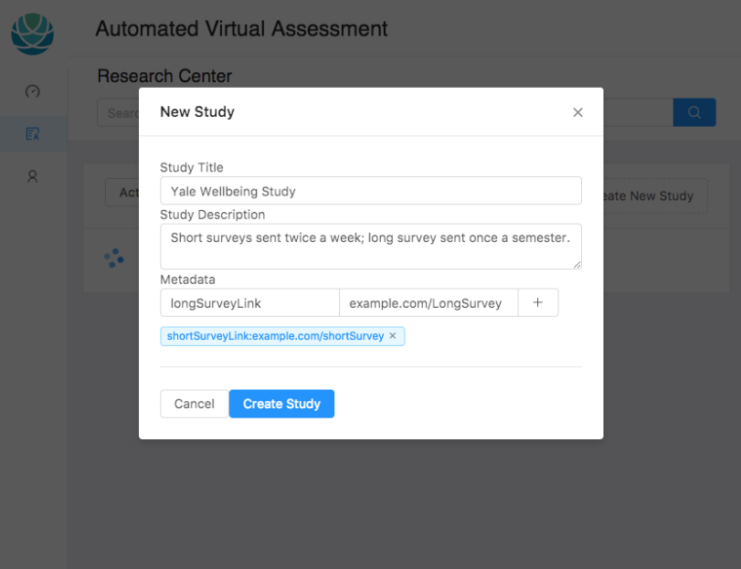
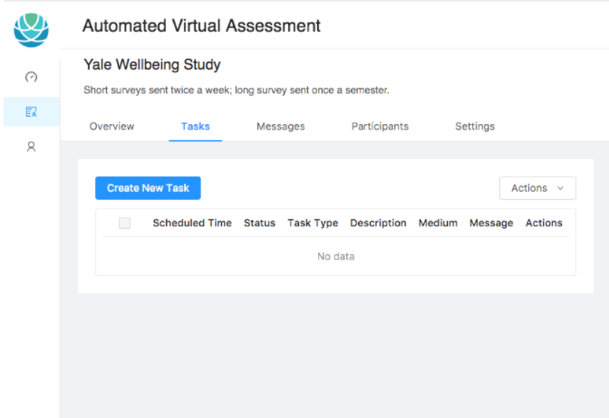
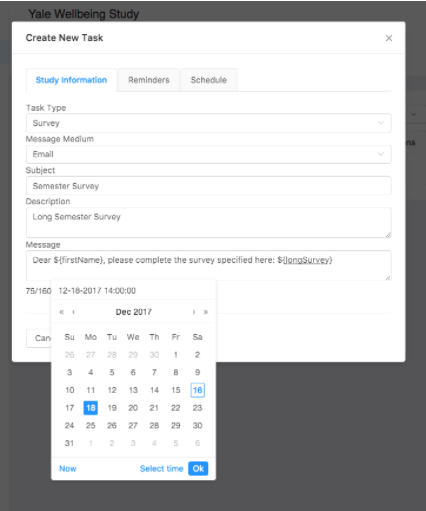
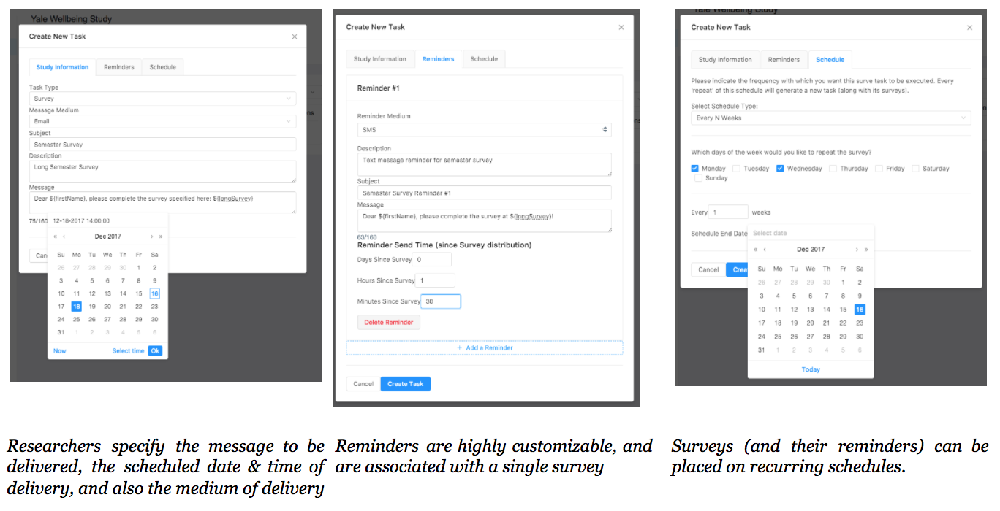
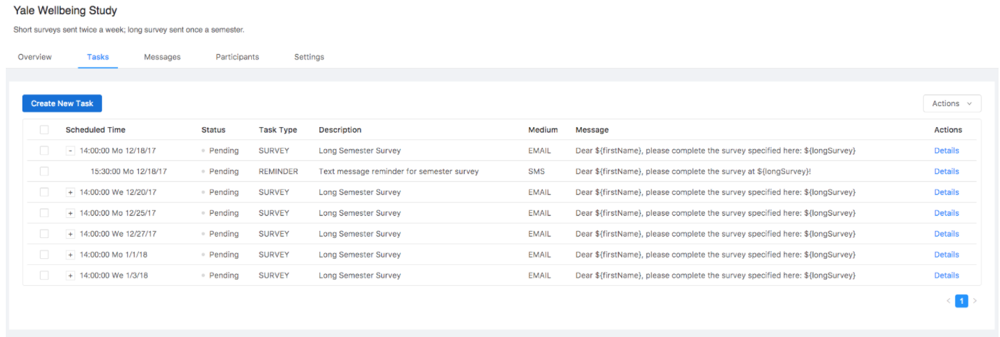
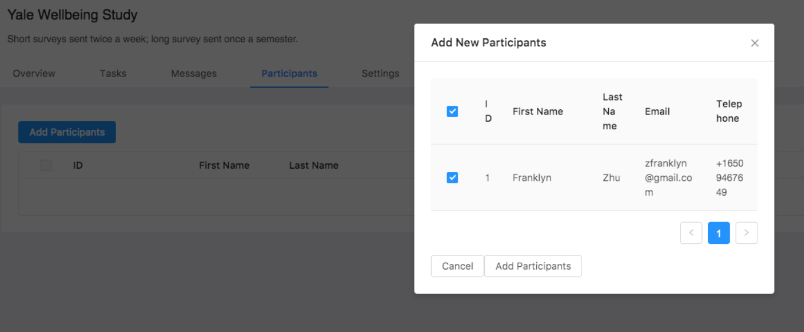

# AVA: Automated Virtual Assessment
Data collection in psychological research suffers from a critical problem of low response rates. Surveys are typically sent en masse via email or hardcopy, and their accompanying reminders fail to distinguish between participants who have completed the survey and those who have not. Automated Virtual Assessment (AVA) is a web-based research suite that allows researchers to enroll participants and send scheduled messages (via both email and SMS) to these participants. This system attempts to increase response rates in two ways: first, it allows participants to receive survey links and accompanying reminders via SMS - a medium less cluttered than email inboxes; second, the system allows researchers to send personalized reminders (based on whether a participant as completed a survey) without compromising user identity, thus providing a secure channel to prompt users.

### How to run this project
In order to run AVA, you must run both `ava-ui` and `ava-api` concurrently. To run `ava-ui`, do the following:
1. Clone the repository: `git clone https://github.com/zfranklyn/ava-ui.git`
2. `cd` into the root directory `/ava-ui`
3. Run `yarn` to install relevant packages
4. Run `yarn start`. UI Development server will be listening on `localhost:3000` — navigate there on your browser.

### Why this project matters
Since the creation of the email by Ray Tomlinson in 1972, email has become an indispensable medium of communication: it made mass communication simple, cheap, and scalable. With convenience, however, came overuse and desensitization: as early as 2001, researchers have observed a significant decreasing trend in email survey response rates (Sheehan, 2001). In a systematic review of survey factors affecting web survey responses, Fan and Yan (2010) attribute low survey response rates to the following key factors:

* Content of questionnaires
* Presentation of web questionnaire
* Sampling Methods
* Contact Delivery Modes
* Designs of Invitations
* Use of pre-notifications and reminders
* Incentives

Low response rates are a critical, yet unsolved problem in psychological research. While psychological researchers have begun to design surveys in accordance with the aforementioned factors in mind — particularly in using modern mobile responsive survey tools (e.g., Qualtrics, Typeform), there remain two factors that researchers are rarely able to effectively address: contact delivery modes and reminders.

While current web-based research tools are designed with mobile-users in mind, none of them are able to send personalized reminders to participants, and all of them are limited to sending surveys through email. Under this format, participants are blasted with standard email templates — they might put aside the email for now, and forget about it. Or they might complete the survey, then receive a redundant email asking them to complete the survey — and disregard it if they have already done so:

AVA represents an attempt at building a solution that allows researchers to address both of these factors. Using AVA, researchers are able to enroll participants and send scheduled surveys and personalized reminders, using either email or SMS.

The following sections will discuss key user interface and system architectural design decisions behind AVA.

### UI Design and Implementation
AVA is designed for two types of users: researchers and participants. The goals and relationship between these two parties are best explained through a real use case with accompanying screenshots:

The Yale Center for Emotional Intelligence is conducting a pilot study to evaluate the efficacy of a new well-being curriculum. Researchers needed to send short surveys to teachers two times a week, and long survey once a semester. Three reminders were to be sent to delinquent participants, at distances of 1-hour, 2-hours, and 3-hours after the survey. Teachers needed an easy way to enroll into the system, and fill out their contact information.

#### Sample Workflow & Screenshots
AVA provides a user interface for Researchers to add participants, create studies, and add scheduled tasks to studies. This process is illustrated in the following screen shots:

1. Researcher creates study, providing information and metadata about the study. Metadata are key-value pairs that are stored with a survey; this metadata can be interpolated into messages to participants.


2. Upon creation of the study, researchers are able to browse the study details and create new tasks:


3. The task modal allows researchers to specify the delivery medium, schedule, and reminders associated with a task. 


4. Once a task is created, it can be viewed (and interacted with) from the general tasks tab in a table format. Both reminders and surveys are types of tasks; the table renders reminders are children of their associated tasks, visually representing a model consistent with the association between surveys and their reminders:


5. Recent tasks and average response rates can be viewed in the overview tab, which lists tasks between the following times: -24 hours ≤ now ≤ + 7 days. 


6. Participants can be added in the participants tab in a similar fashion:


7. Execute tasks, receive messages: when the scheduled time arrives, participants receive the scheduled messages. The scheduling mechanism and tools used to send emails/SMS will be further discussed in later sections.



### Implementation
AVA’s UI was built in Typescript using Facebook’s [React.js](https://reactjs.org/) and Alibaba’s [antd](ant.design) library.

Rationale behind using React.js as the UI Framework
The entire front-end was built using Facebook’s open source UI framework, React. Two other frameworks, Google’s Angular4, and Vue.js were also considered, but I ended up using react because React had the richest set of open-source UI libraries (including Alibaba’s antd, Palantir’s [BlueprintJS](blueprintjs.com)).

#### State Management
UI state was managed without any external libraries. I considered using redux, which would have resulted in a central immutable store to keep track of UI state. However, keeping a central store did not make sense when there were so many smaller components (especially modals) that had to handle complex data input and rendering. Keeping state management on the closest relevant parent component was sufficient, and also obviated the overhead and boilerplate code associated with redux.

#### Choosing Typescript over Javascript
Typescript, a strongly typed language, confers many benefits over Javascript when building complex web applications. First, a strongly typed language forces developers to be clear on inputs, outputs, and interfaces — or else the compiler will throw an error. Second, Typescript allows the definition of interfaces — which enabled me to share unified interfaces between the UI and API code. As such, the compiler emit warnings if something was changed on the API front, but not on in the UI codebase. However, one key limitation with Typescript is that it requires the open-source community to define type definition files. While Typescript support is present for most major libraries, its coverage did not extend to certain key libraries in AVA’s technology stack, including the ORM Sequelize. However, the author was still able to use vanilla Javascript libraries by calling them in the following way:

```
	// No type definitions: 
	const Sequelize = require(‘sequelize’);

	// Existing type definitions:
	Import { Component } from ‘react’;
```

#### Choosing the antd Design Library
The UI was initially built using Palantir’s BlueprintJS library; however, the author later discovered that Alibaba Ant Financial’s antd UI library provided more relevant components out-of-the-box than did BlueprintJS. Using antd’s table components markedly increased UI development speed.

## Tentative Development Timeline
* October 1: Product specifications complete
* October 15: UI Mockups and Database Schemas Complete
* October 18-23: Development over Fall Break; MVP complete, iterations
* November 15: Product development complete
* December 1: Trial launch